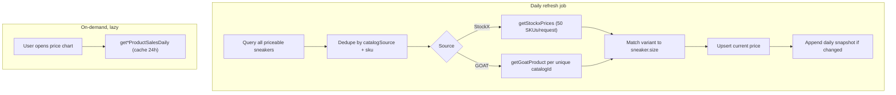

# Sneaker Market Pricing Plan

This document describes what is needed to track **current market value** and **price history** for catalog-linked sneakers in KixVault, while keeping external API requests to a minimum.

**Status:** Planning only — no implementation has started.

## Goals

- Show the current market value for catalog-linked sneakers alongside the user's purchase price.
- Maintain a price history so collection value can be tracked over time.
- Minimize calls to KicksDB (the sole external data provider).
- Serve prices from the database on read paths; never call KicksDB synchronously for list or detail views.

## Non-Goals (v1)

- Real-time pricing (KicksDB Real-Time API is rate-limited and paid).
- Market value for non-catalog or manually entered sneakers without `catalogSource` / `catalogId`.
- Pricing for heavily worn pairs beyond a clear deadstock-price disclaimer.
- GOAT batch pricing (no batch endpoint exists today).

---

## Current State

### Catalog linkage already exists

Sneakers store catalog identity via `catalogSource`, `catalogId`, and `sku` on the `sneakers` table (`packages/db/src/schema.ts`). Catalog-linked sneakers are created through `POST /api/sneakers/from-catalog`, which re-fetches product metadata from KicksDB server-side.

| Field | Example | Purpose |
|-------|---------|---------|
| `catalogSource` | `kicksdb:stockx` | Marketplace via KicksDB |
| `catalogId` | `air-jordan-1-chicago` | Product slug (API + URL) |
| `sku` | `DZ5485-612` | Product SKU |

Catalog URLs are built at response time via `buildCatalogUrl()` in `packages/shared/src/catalog.ts` — they are not stored in the database.

### Pricing today is purchase-only

- `sneakers.purchasePrice` — optional user-entered field.
- `GET /api/stats` — aggregates `totalSpend` and `avgSpend` from purchase prices.
- UI shows "Paid $X" on cards and detail pages.

There are **no** tables, columns, or API fields for market price, current value, or price history.

### External data: KicksDB only

All catalog data flows through `@kicksdb/sdk` (`apps/api/src/lib/catalog.ts`, `apps/api/src/lib/kicksdb.ts`):

| SDK function | Currently used for |
|--------------|-------------------|
| `getStockxProducts` | Catalog search (StockX) |
| `getGoatProducts` | Catalog search (GOAT) |
| `getStockxProduct` | Single product fetch on create (`display[traits]` only) |
| `getGoatProduct` | Single product fetch on create |

Catalog search uses an in-memory 24h cache (`Map`). There is no persisted price cache and no background sync.

### No background jobs

There is no cron, worker, or queue. All KicksDB calls are on-demand (user search or create-from-catalog).

---

## KicksDB Capabilities (Available but Unused)

| Need | StockX | GOAT |
|------|--------|------|
| **Current price (batch)** | `getStockxPrices` — up to **50 SKUs per request**, `show_sizes: true` | No batch API; `getGoatProduct` with `display[prices]` is per-product |
| **Current price (single)** | `getStockxProduct` + `display[prices]` + `display[variants]` | `getGoatProduct` + `display[prices]` |
| **Historical trend** | `getStockxProductSalesDaily` (daily avg + volume) | `getGoatProductSalesDaily` |
| **Real-time** | Real-time endpoints (rate-limited, paid) | Same |

KicksDB's Standard API is refreshed daily — sufficient for collection value tracking without real-time scraping.

---

## Recommended Architecture

### High-level flow



### Core principle: dedupe by catalog identity, not by sneaker row

Many users may own the same SKU. One StockX batch call should price all matching sneakers. Cache at the **catalog SKU + size** level rather than per sneaker row.

**API budget example:** 200 catalog-linked sneakers across 80 unique StockX SKUs → **2 batch calls/day**, not 200.

---

## Database Schema

### Option A — catalog-level cache (preferred)

Stores one price per catalog identity; all sneakers with the same `(catalog_source, sku, size)` share it.

```sql
catalog_market_prices (
  catalog_source  text NOT NULL,
  sku             text NOT NULL,
  size            numeric(4,1) NOT NULL,
  price           numeric(10,2) NOT NULL,
  currency        text NOT NULL DEFAULT 'USD',
  priced_at       timestamptz NOT NULL,
  variant_id      text,
  PRIMARY KEY (catalog_source, sku, size)
)

price_snapshots (
  id              uuid PRIMARY KEY DEFAULT gen_random_uuid(),
  catalog_source  text NOT NULL,
  sku             text NOT NULL,
  size            numeric(4,1) NOT NULL,
  snapshot_date   date NOT NULL,
  price           numeric(10,2) NOT NULL,
  currency        text NOT NULL DEFAULT 'USD',
  UNIQUE (catalog_source, sku, size, snapshot_date)
)
```

Join to `sneakers` on `(catalog_source, sku, size)` for display.

### Option B — sneaker-level (simpler, more redundant)

Add columns to `sneakers` (`current_market_price`, `priced_at`) plus a `sneaker_price_snapshots` table keyed by `sneaker_id`. Easier to implement but duplicates data when multiple users own the same SKU.

**Recommendation:** Option A for multi-user efficiency; Option B is acceptable for a single-tenant deployment.

---

## Price Refresh Service

New module: `apps/api/src/lib/pricing.ts`

### Eligibility

A sneaker is priceable when all of the following are set:

- `catalog_source IS NOT NULL`
- `catalog_id IS NOT NULL`
- `sku IS NOT NULL`

### Refresh algorithm

1. Select all priceable sneakers across all users.
2. Dedupe by `(catalog_source, sku)` for API calls; retain size per row for variant matching.
3. **StockX:** chunk unique SKUs into batches of 50 → `getStockxPrices({ body: { skus, market: 'US', show_sizes: true } })`.
4. **GOAT:** one `getGoatProduct` per unique `catalog_id` with `display[prices]` and `display[variants]`.
5. Match `sneakers.size` to the returned variant (see Size Matching below).
6. Upsert `catalog_market_prices`.
7. Insert into `price_snapshots` once per day per `(catalog_source, sku, size)` if the price changed.

### Refresh cadence

- **Daily** — aligns with KicksDB Standard API refresh; predictable cost.
- Triggered by a scheduled job, not by user page loads.
- Optional manual refresh endpoint, rate-limited.

### Background job (new infrastructure)

No scheduler exists today. Options:

- External cron hitting a protected internal route (`POST /api/internal/pricing/refresh`).
- A small worker process (e.g. BullMQ).
- Platform cron (Railway, Fly, GitHub Actions).

---

## API Surface Changes

| Change | Purpose |
|--------|---------|
| Enrich `GET /api/sneakers` and sneaker detail with `currentMarketPrice`, `pricedAt`, `gainLoss` | Collection and detail views |
| Extend `GET /api/stats` with `totalMarketValue`, `totalGainLoss` | Dashboard |
| `GET /api/sneakers/:id/price-history` | Lazy-load chart data |
| `POST /api/internal/pricing/refresh` (optional) | Manual or cron-triggered refresh |

All read endpoints serve cached database values. KicksDB is only called from the refresh job or lazy chart endpoints.

---

## Price History Strategy

Two tiers, fetched at different times:

| Tier | Source | When to fetch | Extra API cost |
|------|--------|---------------|----------------|
| **Owned history** | Daily snapshots from refresh job | Written during daily refresh | None |
| **Market trend chart** | `getStockxProductSalesDaily` / `getGoatProductSalesDaily` | Only when user opens detail chart | 1 call per product, cache 24h |

For v1, daily snapshots from the refresh job may be sufficient for "my collection value over time." Platform sales-daily data is better for "market trend for this model" but costs an extra call per chart view.

---

## Challenges and Decisions

### Size matching

KicksDB returns sizes like `"11"` with `size_type: "us m"`. `sneakers.size` is `numeric(4,1)`. Normalization is required for half sizes, trailing `.0`, and potential future women's sizing.

### Condition

Market APIs return deadstock lowest-ask prices. For `lightly_worn`, `worn`, and `beat`:

- Skip market value and show "N/A", **or**
- Show deadstock price with a clear disclaimer.

Recommend: show deadstock price with disclaimer for `lightly_worn`; skip for `worn` / `beat`.

### Catalog source split

StockX is cheap to refresh (batch). GOAT requires one call per unique product. Prioritize StockX in Phase 1; add GOAT in Phase 3.

### Manual entries with SKU

Catalog-linked immutability is keyed off `sku` alone. Manual entries may have a SKU but lack `catalogSource` / `catalogId` — these should be excluded from pricing until properly linked.

### Multi-instance deployment

The in-memory catalog cache does not dedupe across API replicas. Price data must live in Postgres, not in-memory `Map`s.

### KicksDB plan limits

Confirm the KicksDB tier's rate limits and whether GOAT pricing / sales-daily endpoints are included before implementation.

---

## Phased Rollout

| Phase | Scope | API impact |
|-------|-------|------------|
| **1** | DB schema + StockX batch refresh + current price on cards/detail | `ceil(unique_skus / 50)` calls/day |
| **2** | Daily snapshots → collection value over time + stats aggregates | Same refresh job, no extra calls |
| **3** | GOAT current pricing | +1 call per unique GOAT `catalog_id`/day |
| **4** | On-demand sales-daily charts on detail page | +1 call per chart view (24h cache) |

---

## Files Likely Touched (Implementation)

| Area | Files |
|------|-------|
| Schema | `packages/db/src/schema.ts`, new Drizzle migration |
| Shared types | `packages/shared/src/schemas/sneaker.ts`, new `pricing.ts` schema |
| Pricing logic | New `apps/api/src/lib/pricing.ts` |
| KicksDB wiring | `apps/api/src/lib/kicksdb.ts`, `apps/api/src/test/mocks/kicksdb.ts` |
| Routes | `apps/api/src/routes/sneakers.ts`, `apps/api/src/routes/stats.ts`, new pricing/internal route |
| Scheduler | New script or internal route + deployment config |
| UI | `apps/web/src/components/sneakers/sneaker-card.tsx`, detail page, `apps/web/src/components/collection/stats-cards.tsx` |
| Queries | `apps/web/src/lib/queries.ts` |

---

## Open Questions

1. **Catalog-level vs sneaker-level storage** — Option A is more efficient at scale; Option B is simpler. Which fits the deployment model?
2. **Condition handling** — Skip vs disclaimer for non-deadstock pairs?
3. **Refresh trigger** — External cron vs in-process scheduler vs platform cron?
4. **Currency** — US market only (current `MARKET = 'US'` in catalog.ts) or multi-market support later?
5. **KicksDB tier** — Confirm batch limits and GOAT endpoint access on the current plan.

---

## Summary

Most catalog identity work is already in place. The main gaps are:

1. Persisted price storage (current value + snapshots).
2. A pricing service that batches by SKU (StockX) instead of per-sneaker.
3. A daily refresh job so reads never hit KicksDB.
4. Size matching and condition rules.
5. UI to show current value vs paid, and optional history.

The highest-leverage decision for minimal API usage: **dedupe and cache at the catalog SKU + size level**, refresh once per day, and lazy-load historical chart data only on detail views.
