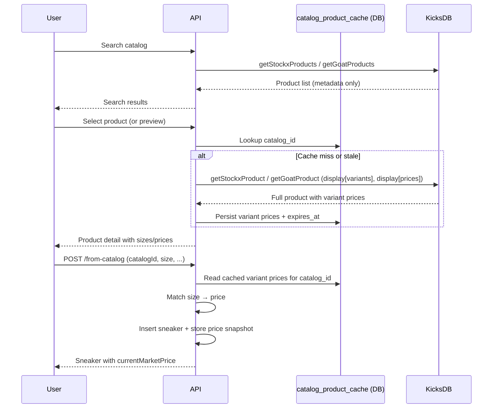
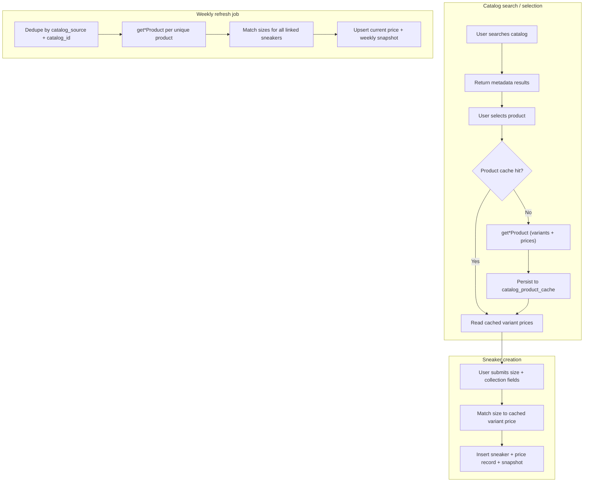

# Sneaker Market Pricing Plan

This document describes what is needed to track **current market value** and **price history** for catalog-linked sneakers in KixVault, while keeping external API requests to a minimum.

**Status:** Planning only — no implementation has started.

## Goals

- Show the current market value for catalog-linked sneakers alongside the user's purchase price.
- Maintain a price history so collection value can be tracked over time.
- Minimize calls to KicksDB (the sole external data provider).
- Serve prices from the database on read paths; never call KicksDB synchronously for list or detail views.

## Non-Goals (v1)

- Real-time pricing (KicksDB Real-Time API is rate-limited and paid).
- Batch pricing (`getStockxPrices`) — requires a paid KicksDB plan and is out of scope.
- Market value for non-catalog or manually entered sneakers without `catalogSource` / `catalogId`.
- Pricing for heavily worn pairs beyond a clear deadstock-price disclaimer.

---

## Current State

### Catalog linkage already exists

Sneakers store catalog identity via `catalogSource`, `catalogId`, and `sku` on the `sneakers` table (`packages/db/src/schema.ts`). Catalog-linked sneakers are created through `POST /api/sneakers/from-catalog`, which re-fetches product metadata from KicksDB server-side.

| Field | Example | Purpose |
|-------|---------|---------|
| `catalogSource` | `kicksdb:stockx` | Marketplace via KicksDB |
| `catalogId` | `air-jordan-1-chicago` | Product slug (API + URL) |
| `sku` | `DZ5485-612` | Product SKU |

Catalog URLs are built at response time via `buildCatalogUrl()` in `packages/shared/src/catalog.ts` — they are not stored in the database.

### Pricing today is purchase-only

- `sneakers.purchasePrice` — optional user-entered field.
- `GET /api/stats` — aggregates `totalSpend` and `avgSpend` from purchase prices.
- UI shows "Paid $X" on cards and detail pages.

There are **no** tables, columns, or API fields for market price, current value, or price history.

### External data: KicksDB only

All catalog data flows through `@kicksdb/sdk` (`apps/api/src/lib/catalog.ts`, `apps/api/src/lib/kicksdb.ts`):

| SDK function | Currently used for |
|--------------|-------------------|
| `getStockxProducts` | Catalog search (StockX) |
| `getGoatProducts` | Catalog search (GOAT) |
| `getStockxProduct` | Single product fetch on create (`display[traits]` only) |
| `getGoatProduct` | Single product fetch on create |

Catalog search uses an in-memory 24h cache (`Map`). There is no persisted price cache and no background sync.

### No background jobs

There is no cron, worker, or queue. All KicksDB calls are on-demand (user search or create-from-catalog).

---

## KicksDB Pricing Endpoints

Both StockX and GOAT pricing use the **single-product** endpoint. Batch pricing (`POST /v3/stockx/prices`) is only available on a paid KicksDB plan and is **not** in scope.

| Marketplace | Endpoint | SDK function | Pricing query params |
|-------------|----------|--------------|---------------------|
| StockX | [`GET /v3/stockx/products/{id}`](https://api.kicks.dev/docs#tag/stockx/GET/v3/stockx/products/{id}) | `getStockxProduct` | `display[variants]=true`, `display[prices]=true` |
| GOAT | [`GET /v3/goat/products/{id}`](https://api.kicks.dev/docs#tag/goat/GET/v3/goat/products/{id}) | `getGoatProduct` | `display[variants]=true`, `display[prices]=true` |

With `display[prices]=true`, each variant includes a `prices` array with the lowest ask per delivery type (`standard`, `express_standard`, `express_expedited`). Use the `standard` price for collection value.

Other useful endpoints (not required for v1 current price):

| Need | StockX | GOAT |
|------|--------|------|
| **Historical trend** | `getStockxProductSalesDaily` | `getGoatProductSalesDaily` |
| **Real-time** | Real-time endpoints (rate-limited, paid) | Same |

KicksDB's Standard API is refreshed daily — sufficient for collection value tracking without real-time scraping.

---

## When Prices Are Stored

Prices are written at exactly two points. All other reads come from the database.

### 1. On catalog sneaker creation

When a user adds a sneaker from the catalog, their **size is known at creation time**. The price for that `(catalog_source, catalog_id, size)` should be stored immediately — no extra KicksDB call on the create path.

To avoid a redundant fetch at create time, **variant pricing must be cached when the product is first loaded during search/selection**. The typical flow:



The create handler (`POST /api/sneakers/from-catalog`) should **not** make a separate KicksDB call if a fresh cached product with prices already exists. The existing `fetchCatalogProduct()` call should be extended (or replaced) to use the cache populated during selection.

### 2. On a weekly schedule

A background job refreshes prices for all catalog-linked sneakers in the collection:

1. Select all priceable sneakers (`catalog_source`, `catalog_id`, `sku` all set).
2. Dedupe by `(catalog_source, catalog_id)` — one API call per unique product, not per sneaker row.
3. Fetch each product via the single-product endpoint with `display[variants]` and `display[prices]`.
4. Match each sneaker's `size` to the returned variant price.
5. Upsert current price and append a weekly snapshot.

**Weekly cadence** keeps API usage predictable. With deduplication, a collection of 50 sneakers across 30 unique catalog products costs **30 API calls per week**, not 50.

---

## Recommended Architecture

### High-level flow



### Core principles

1. **One API call per unique catalog product** — dedupe across sneakers and users by `(catalog_source, catalog_id)`.
2. **Cache product prices at selection time** — so creation is a cache read, not another KicksDB call.
3. **Persist cache in the database** — the in-memory search `Map` is per-process and does not survive restarts or span replicas.
4. **Weekly refresh** — not daily; aligns with collection-tracking use case and limits API volume.

### API budget examples

| Scenario | Calls |
|----------|-------|
| User searches, selects 1 product, creates 1 sneaker | 1 search call + 1 product call (cached for create) |
| User creates 3 sneakers same product, different sizes | 1 product call (cache reused for all 3 creates) |
| Collection of 50 sneakers, 30 unique products, weekly refresh | 30 calls/week |
| 10 users each add a new sneaker for the same product in one week | 1 product call (shared cache) + 0 on subsequent creates |

---

## Database Schema

### `catalog_product_cache`

Persists full product data (including variant prices) fetched during catalog selection. Shared across users and creation events.

```sql
catalog_product_cache (
  catalog_source  text NOT NULL,
  catalog_id      text NOT NULL,
  sku             text NOT NULL,
  variant_prices  jsonb NOT NULL,  -- array of { size, size_type, price, variant_id }
  fetched_at      timestamptz NOT NULL,
  expires_at      timestamptz NOT NULL,
  PRIMARY KEY (catalog_source, catalog_id)
)
```

`variant_prices` stores all size-level prices from the product response so any size can be resolved without re-fetching. TTL should be long enough to cover the search → create flow (e.g. 24h) but short enough that stale prices are refreshed by the weekly job.

### `catalog_market_prices`

Current resolved price per catalog identity + size. Updated on create and weekly refresh.

```sql
catalog_market_prices (
  catalog_source  text NOT NULL,
  sku             text NOT NULL,
  size            numeric(4,1) NOT NULL,
  price           numeric(10,2) NOT NULL,
  currency        text NOT NULL DEFAULT 'USD',
  priced_at       timestamptz NOT NULL,
  variant_id      text,
  PRIMARY KEY (catalog_source, sku, size)
)
```

Join to `sneakers` on `(catalog_source, sku, size)` for display.

### `price_snapshots`

Historical record for collection value over time.

```sql
price_snapshots (
  id              uuid PRIMARY KEY DEFAULT gen_random_uuid(),
  catalog_source  text NOT NULL,
  sku             text NOT NULL,
  size            numeric(4,1) NOT NULL,
  snapshot_date   date NOT NULL,
  price           numeric(10,2) NOT NULL,
  currency        text NOT NULL DEFAULT 'USD',
  UNIQUE (catalog_source, sku, size, snapshot_date)
)
```

Written on sneaker creation (first data point) and on each weekly refresh (one snapshot per week per `(catalog_source, sku, size)`).

---

## Price Refresh Service

New module: `apps/api/src/lib/pricing.ts`

### Eligibility

A sneaker is priceable when all of the following are set:

- `catalog_source IS NOT NULL`
- `catalog_id IS NOT NULL`
- `sku IS NOT NULL`

### Product fetch (shared by cache, create, and refresh)

```typescript
// StockX
getStockxProduct({
  path: { id: catalogId },
  query: {
    market: 'US',
    'display[variants]': true,
    'display[prices]': true,
  },
});

// GOAT
getGoatProduct({
  path: { id: catalogId },
  query: {
    market: 'US',
    'display[variants]': true,
    'display[prices]': true,
  },
});
```

Extract the `standard` lowest ask per variant and build the `variant_prices` array for caching.

### On create

1. Read `catalog_product_cache` for `(catalog_source, catalog_id)`.
2. If cache miss or expired, fetch product (this is the fallback — normally the cache is warm from selection).
3. Match `size` to variant price.
4. Insert sneaker.
5. Upsert `catalog_market_prices`.
6. Insert `price_snapshots` row for today.

### Weekly refresh

1. Select all priceable sneakers; dedupe by `(catalog_source, catalog_id)`.
2. For each unique product, call the single-product endpoint.
3. Update `catalog_product_cache`.
4. For each sneaker sharing that product, match `size` → price.
5. Upsert `catalog_market_prices`.
6. Insert `price_snapshots` if the week has no snapshot yet (or if price changed).

### Background job (new infrastructure)

No scheduler exists today. Options:

- External cron hitting a protected internal route (`POST /api/internal/pricing/refresh`) on a weekly schedule.
- Platform cron (Railway, Fly, GitHub Actions).

---

## Catalog Search Changes

The search flow needs to be extended so prices are available before create:

| Step | Current | Planned |
|------|---------|---------|
| Search | `getStockxProducts` / `getGoatProducts` — metadata only | Unchanged (list endpoints do not return per-size prices) |
| Product selection | No server call until create | New endpoint or expanded flow: fetch single product with prices and cache |
| Create | `fetchCatalogProduct()` — traits only, no prices | Read from `catalog_product_cache`; store matched size price |

A new endpoint such as `GET /api/catalog/products/:source/:id` (or fetching on selection in the existing picker) should call the single-product endpoint, persist to `catalog_product_cache`, and return variant prices to the frontend so the user can see pricing while choosing a size.

---

## API Surface Changes

| Change | Purpose |
|--------|---------|
| `GET /api/catalog/products/:source/:id` | Fetch + cache product with variant prices on selection |
| Enrich `GET /api/sneakers` and sneaker detail with `currentMarketPrice`, `pricedAt`, `gainLoss` | Collection and detail views |
| Extend `GET /api/stats` with `totalMarketValue`, `totalGainLoss` | Dashboard |
| `GET /api/sneakers/:id/price-history` | Price snapshots over time |
| `POST /api/internal/pricing/refresh` | Weekly cron-triggered refresh |

All read endpoints serve cached database values. KicksDB is only called during catalog product selection, sneaker creation (cache miss fallback), and the weekly refresh job.

---

## Price History Strategy

| Tier | Source | When written | Extra API cost |
|------|--------|--------------|----------------|
| **Collection history** | `price_snapshots` table | On create + weekly refresh | None (piggybacks on existing product fetches) |
| **Market trend chart** | `getStockxProductSalesDaily` / `getGoatProductSalesDaily` | Only when user opens detail chart (future) | 1 call per product, cache 24h |

For v1, snapshots from create + weekly refresh are sufficient for "my collection value over time."

---

## Challenges and Decisions

### Size matching

KicksDB returns sizes like `"11"` with `size_type: "us m"`. `sneakers.size` is `numeric(4,1)`. Normalization is required for half sizes, trailing `.0`, and potential future women's sizing.

### Condition

Market APIs return deadstock lowest-ask prices. For `lightly_worn`, `worn`, and `beat`:

- Skip market value and show "N/A", **or**
- Show deadstock price with a clear disclaimer.

Recommend: show deadstock price with disclaimer for `lightly_worn`; skip for `worn` / `beat`.

### Cache freshness between selection and create

The user may search, leave, and return later to create. The `catalog_product_cache` TTL (e.g. 24h) must cover typical flows. If expired at create time, fall back to a single product fetch.

### Manual entries with SKU

Catalog-linked immutability is keyed off `sku` alone. Manual entries may have a SKU but lack `catalogSource` / `catalogId` — these should be excluded from pricing until properly linked.

### Multi-instance deployment

The in-memory catalog search cache does not dedupe across API replicas. `catalog_product_cache` and price tables must live in Postgres.

### Rate limits

With per-product fetches, deduplication is critical. The weekly job should stagger requests if KicksDB rate limits apply (e.g. small delay between calls, or process in batches over the week).

---

## Phased Rollout

| Phase | Scope | API impact |
|-------|-------|------------|
| **1** | DB schema + `catalog_product_cache` + product fetch on selection + price on create | 1 product call per new catalog product selected |
| **2** | Weekly refresh job + `price_snapshots` + current price on cards/detail/stats | 1 call per unique catalog product per week |
| **3** | Price history UI (collection value over time from snapshots) | None |
| **4** | On-demand market trend charts (`*SalesDaily`) | 1 call per chart view (24h cache) |

---

## Files Likely Touched (Implementation)

| Area | Files |
|------|-------|
| Schema | `packages/db/src/schema.ts`, new Drizzle migration |
| Shared types | `packages/shared/src/schemas/sneaker.ts`, `packages/shared/src/schemas/catalog.ts`, new `pricing.ts` schema |
| Catalog + pricing | `apps/api/src/lib/catalog.ts`, new `apps/api/src/lib/pricing.ts` |
| KicksDB wiring | `apps/api/src/lib/kicksdb.ts`, `apps/api/src/test/mocks/kicksdb.ts` |
| Routes | `apps/api/src/routes/catalog.ts`, `apps/api/src/routes/sneakers.ts`, `apps/api/src/routes/stats.ts`, new internal pricing route |
| Scheduler | New script or internal route + deployment config |
| UI | `catalog-search-picker.tsx`, `catalog-sneaker-form.tsx`, `sneaker-card.tsx`, detail page, `stats-cards.tsx` |
| Queries | `apps/web/src/lib/catalog.ts`, `apps/web/src/lib/queries.ts` |

---

## Open Questions

1. **Condition handling** — Skip vs disclaimer for non-deadstock pairs?
2. **Refresh trigger** — External cron vs platform cron for the weekly job?
3. **Cache TTL** — How long should `catalog_product_cache` entries remain valid before a create-time re-fetch?
4. **Currency** — US market only (current `MARKET = 'US'` in catalog.ts) or multi-market support later?
5. **Rate limit handling** — Stagger weekly refresh calls or spread across the week?

---

## Summary

Most catalog identity work is already in place. The main gaps are:

1. Persisted price storage (`catalog_product_cache`, `catalog_market_prices`, `price_snapshots`).
2. Product fetch with variant prices at catalog **selection** time, cached in the database.
3. Price resolution and storage at sneaker **creation** time (cache read, not a new API call).
4. A **weekly** refresh job that dedupes by `(catalog_source, catalog_id)`.
5. Size matching, condition rules, and UI to show current value vs paid.

Both StockX and GOAT use the same per-product pricing model. The highest-leverage decisions for minimal API usage: **cache product prices at selection**, **dedupe by catalog product identity**, and **refresh weekly** rather than on every read.
